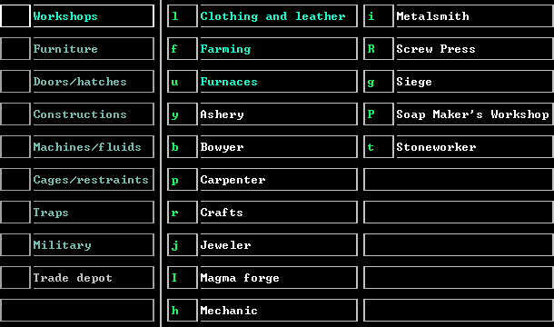
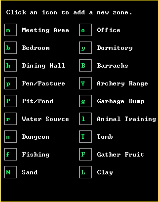

# Definability Scripts for DFHack

Custom scripts to improve [Dwarf Fortress][df]
gameplay via [DFHack] modding engine.

Tip for beginners:
you can [download Dwarf Fortress][df] for free from the official website
or buy it on [Steam][df-steam] or [itch.io][df-itch] to get improved visuals and audio
and support developers.
DFHack is available for free on the [official GitHub page][DFHack]
and [Steam][dfhack-steam].

Below is the description of the components contained in this repository.
I plan to add more in the future.

## zone-bindings

Read [docs/zone-bindings.rst]
if you want to understand the script usage.
However, the following instructions may suffice.

Zones, unlike buildings, do not have key bindings in the vanilla version of the game.
When you are going to create multiple temples or guilds, using mouse becomes annoying.
This script allows you to remove this restriction with maximum customisation.

To activate it, copy [zone-bindings.lua] to your `hack/scripts` directory
and add the desired key bindings to `dfhack-config/init/dfhack.init`.

### Recommended settings

In the following configuration example,
zones are sorted and grouped just like they appear in the game
for readability:
```
# zone painting, left column
keybinding add M@dwarfmode/Zone "zone-bindings meeting-area"
keybinding add B@dwarfmode/Zone "zone-bindings bedroom"
keybinding add H@dwarfmode/Zone "zone-bindings dining-hall"
keybinding add P@dwarfmode/Zone "zone-bindings pen-pasture"
keybinding add Shift-P@dwarfmode/Zone "zone-bindings pit-pond"
keybinding add R@dwarfmode/Zone "zone-bindings water-source"
keybinding add N@dwarfmode/Zone "zone-bindings dungeon"
keybinding add F@dwarfmode/Zone "zone-bindings fishing"
keybinding add Shift-N@dwarfmode/Zone "zone-bindings sand"
# zone painting, right column
keybinding add O@dwarfmode/Zone "zone-bindings office"
keybinding add Y@dwarfmode/Zone "zone-bindings dormitory"
keybinding add Shift-B@dwarfmode/Zone "zone-bindings barracks"
keybinding add Shift-Y@dwarfmode/Zone "zone-bindings archery-range"
keybinding add G@dwarfmode/Zone "zone-bindings garbage-dump"
keybinding add L@dwarfmode/Zone "zone-bindings animal-training"
keybinding add Shift-T@dwarfmode/Zone "zone-bindings tomb"
keybinding add Shift-F@dwarfmode/Zone "zone-bindings gather-fruit"
keybinding add Shift-L@dwarfmode/Zone "zone-bindings clay"
```

## gui/visible-hotkeys

To start using this module,
copy [gui/visible-hotkeys.lua] to your `hack/scripts/gui` directory
and [internal/visible-hotkeys] to your `hack/scripts/internal` directory.

Read [docs/gui/visible-hotkeys.rst]
if you want to understand the module usage.
However, the following instructions may suffice.

### gui/visible-hotkeys.building

By default, the game UI gives pop-up hints regarding the building hotkeys.
It is inefficient for gaining the muscle memory for the bindings.
This overlay displays the hotkeys in the corresponding icon tiles.

Building menu key bindings overlay:



### gui/visible-hotkeys.zone

Zones, unlike buildings, do not have key bindings in the vanilla version of the game.
When you are going to create multiple temples or guilds, using mouse becomes annoying.
This script allows you to remove this restriction with maximum customisation.

To activate it, enable the overlay
by adding the following lines to your `dfhack-config/init/dfhack.init`:
```
overlay enable gui/visible-hotkeys.zone
```

Once you call zone menu (`z` by default) in Fortress mode,
you will see the hints displayed on tiles corresponding to the zone types.

Zone key bindings overlay:



#### Default key bindings

The following hotkeys are available by default in zone selection menu
once you enable the script:

- Meeting Area: `m`
- Bedroom: `b`
- Dining Hall: `h`
- Pen/Pasture: `p`
- Pit/Pond: `P`
- Water Source: `r`
- Dungeon: `n`
- Fishing: `f`
- Sand: `N`
- Office: `o`
- Dormitory: `y`
- Barracks: `B`
- Archery Range: `Y`
- Garbage Dump: `g`
- Animal Training: `l`
- Tomb: `T`
- Gather Fruit: `F`
- Clay: `L`

Lowercase letters mean just pressing the key,
and uppercase letters mean holding the `Shift` button and pressing the key.

#### Custom key bindings

You can create your own assignments in `dfhack-config/init/dfhack.init`.
If your new key binding conflicts with any other hotkey managed by the script,
it will be unassigned first.

For example, the following code assigns `Shift-A` for painting a meeting area,
`O` (`O` without `Shift`) for painting tomb,
and removes binding for the pit/pond zone:
```
overlay trigger gui/visible-hotkeys.zone add Meeting Area A
overlay trigger gui/visible-hotkeys.zone add Tomb o
overlay trigger gui/visible-hotkeys.zone clear Pit/Pond
```

By default, `o` is used for office,
so these commands will also remove the key bindings for office.

[DFHack]: https://github.com/DFHack/dfhack/
[dfhack-steam]: https://store.steampowered.com/app/2346660/DFHack__Dwarf_Fortress_Modding_Engine/
[df]: https://www.bay12games.com/dwarves/
[df-steam]: https://store.steampowered.com/app/975370
[df-itch]: https://kitfoxgames.itch.io/dwarf-fortress
[docs/gui/visible-hotkeys.rst]: docs/gui/visible-hotkeys.rst
[docs/zone-bindings.rst]: docs/zone-bindings.rst
[gui/visible-hotkeys.lua]: gui/visible-hotkeys.lua
[internal/visible-hotkeys]: internal/visible-hotkeys
[zone-bindings.lua]: zone-bindings.lua
